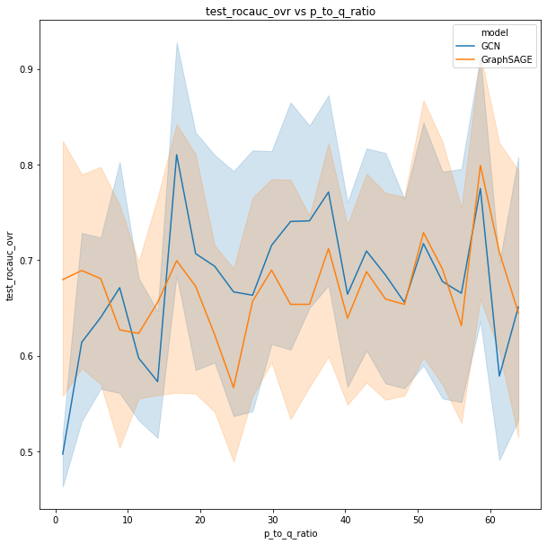

# GraphWorld

Welcome! GraphWorld is a method and
toolbox for graph learning researchers to systematically test new models on
*synthetic* graph datasets. Our [full paper](https://arxiv.org/abs/2203.00112)
hass been accepted to KDD 2022.

Why synthetic?
Graph learning experimentation over time has depended largely on the same
collection of citation network, social network, and molecular datasets (such
as Cora, CiteSeer, etc.). For a particular task such as node classification,
the datasets have similar statistical properties, e.g. homophily. Therefore it
is usually impossible to know how GNN experimental results generalize beyond the
standard citation network benchmarks. Furthermore, GNN researchers are
incentivized to optimize their innovations toward these datasets.

GraphWorld uses scalable synthetic graph generation to address these issues. A
user can specify a generative model for a task, and any number of parameters
that control the statistical properties of the generator. GraphWorld then
samples from the generator to produce a diverse "world" of graph datasets, on
which standard benchmark datasets are just individual points. GraphWorld also
trains and tests any number of (user-)specified GNN models on each synthetic
dataset, and outputs easily-consumable tabular data for analyzing the results.
This allows researchers to test GNNs far outside the statistical realm of the
usual datasets! Check out our official [Google AI blog post](https://goo.gle/3wdl8rU)
for more detail!

The animation below was constructed from a GraphWorld node classification
pipeline. It shows that GNN model rankings actually *change* when they are
tested on GraphWorld datasets with different statistical properties than the classic
benchmarks.

## Starter GraphWorld pipeline

GraphWorld can be run on the cloud or on your personal computer. Here is a
 working example that can be run on a PC. In this small GraphWorld
experiment, we will see how variance in the label homophily of graph datasets
affect GNN node classification performance.

A user of GraphWorld decides on a generative model for
the task (in this case, node classification). GraphWorld comes with default
generative models for node classification, link prediction, and graph property
prediction. In this codebase (and in our
[paper](https://arxiv.org/abs/2203.00112)), we use the Stochastic Block Model
(SBM) as the default generative model for node classification datasets. In our
implementation of  the SBM, the parameter `p_to_q_ratio` controls the *ratio* of
the probability that two nodes in the same class connect, relative to the
probability that two nodes in different classes connect. GraphWorld will
generate many synthetic graphs with uniformly-sampled values of `p_to_q_ratio`,
allowing for the analysis of GNN models on graphs with many different homophily
levels.

Here are the steps to run the pipeline:

1. Install [Docker](https://www.docker.com/).

2. Build the local version of the GraphWorld docker image: `./build_local.sh`.
   This should take about 5 minutes.

3. Run the GraphWorld pipeline with `./main_local_mwe.sh`! This should also take
   about 5 minutes.
   
What happened? GraphWorld generated 500 instances of the SBM, each with a
different sampled value of `p_to_q_ratio` from the range specified in
`configs/sbm_generator_config_mwe.gin`. It then trained and tested the four
GNN models specified in `sbm_config_mwe.gin` (GCN and GAT), and saved the test
metrics to  the local folder `/tmp/mwe`, specified in `./main_local_mwe.sh`.

Let's analyze the test metrics to see how well the four models did. You can run
the `GraphWorld_README_Example` notebook to compare GCN and GAT over the space
of graphs generated by GraphWorld:

We see that both models slightly increase their
average performance as `p_to_q_ratio` goes up -- this makes sense,
as more-homophilous classes are easier to classify! However, the observed
increase is very slight, since these averages are computed over SBM graphs
with very different properties, which could interfere with the homophily
effect. In our paper, we describe ways to use GraphWorld to tease out
marginal effects of various generator parameters and graph statistics,
resulting in higher-res analyses.

## Extensions
The analysis functions in the notebook can also be used to explore the
relationship between GNN models and *other* parameters of the SBM, and even
graph statistics computed after-the-fact (non-parameters). Additionally,
GraphWorld supports:

* Large-scale experiments using Google Cloud Platform
* Custom graph generators and brand-new tasks
* Any GNN model you can implement in Python

In the coming months, we will release instructions for these extensions to
enable our future power-users!

## Contributing

See [`CONTRIBUTING.md`](CONTRIBUTING.md) for details.

## License

Apache 2.0; see [`LICENSE`](LICENSE) for details.

## Disclaimer

This project is not an official Google project. It is not supported by
Google and Google specifically disclaims all warranties as to its quality,
merchantability, or fitness for a particular purpose.
